# CLIMORFA — Climate-Morphology Fusion Architecture

[](LICENSE)
[](LICENSE-docs)
[](https://www.python.org/)


Reproducible analysis pipeline for **CLIMORFA** — a weak-label baseline for
climate-relevant urban fabric classification in the Izmir functional urban
region, Türkiye.

---

## Key metrics

| | | |
|---|---|---|
| **16,506** grid cells | **374** morphometric, spectral, and network fields | **0.838** LightGBM macro-F1 |
| **11** leave-one-district-out districts | **0.723** mean LODO macro-F1 | **569** manually audited cells |
| **8.3%** exact-class agreement with audited ground truth | **4** model families | **H = 1592** Kruskal-Wallis LST |

---

## The analytical chain

```mermaid
flowchart LR
    A[Surface model · OSM · GEE · Population] --> B[Feature engineering<br/>374 fields, 250 m grid]
    B --> C[Weak LCZ labels<br/>WUDAPT, confidence ≥ 0.60]
    C --> D[Model training<br/>LightGBM · XGBoost · RF · ET]
    D --> E[5-fold spatial CV<br/>1.25 km blocks]
    E --> F[Explainability<br/>impurity importance · class medians]
    F --> G[Leave-district-out<br/>11 districts]
    G --> H[Climate validation<br/>LST · NDVI · NDBI]
    H --> I[Manual audit<br/>569 cells]
```



---

## Reproduce the workflow

```bash
git clone https://github.com/YusufEminoglu/climorfa.git
cd climorfa
mamba env create -f environment.yml
mamba activate climorfa
```

### Required external data

This repository does **not** redistribute third-party geospatial data.
Obtain these from their original providers:

| Dataset | Source | Access |
|---|---|---|
| Surface model | Local administration | Local administration |
| OpenStreetMap | OSM / Geofabrik | Overpass API |
| Landsat 8/9 LST | USGS / Google Earth Engine | `ee.ImageCollection` |
| Sentinel-2 | ESA / Google Earth Engine | `ee.ImageCollection` |
| Dynamic World | Google / Earth Engine | `ee.ImageCollection` |
| ETH Canopy Height | ETH Zurich / Earth Engine | `ee.Image` |
| WUDAPT LCZ | WUDAPT | Download portal |
| Building footprints | Local administration | Local administration |

See `docs/data_sources.md` for detailed access instructions.

### Public repository policy

This is a conventional public GitHub repository. Manuscript source, figures,
analysis code, configuration, and reproducibility documentation are versioned
directly in Git. Restricted or provider-licensed inputs, generated build
artifacts, logs, and temporary files remain excluded by `.gitignore`; updating
the remote repository does not remove files from a local working copy.

### Entry points

```bash
# Manuscript evidence bundle (tables, QA manifest, model metrics)
python scripts/generate_manuscript_evidence.py

# Individual figures
python scripts/build_figure_1_texture_atlas.py
python scripts/build_figure_2_methodology_multipanel.py
# ... (build_figure_1 through build_figure_11)

# Citation audit
python scripts/audit_manuscript_citations.py
```

---

## Repository map

```
climorfa/
├── src/                          # Analysis pipeline
│   ├── data_prep/                # Data download, clip, aggregate to grid
│   ├── diagnostics/              # QA, visual review, audit tools
│   └── modeling/                 # Model training, LODO, evaluation
├── scripts/                      # Figure builders and evidence generator
├── configs/                      # Feature-set manifest
├── paper/figures/
│   ├── main/                     # Main-article figures (PNG)
│   └── supplementary/            # Supplementary figures (PNG)
├── docs/                         # Data sources and reproducibility
├── data/                         # Data staging (README only; data is gitignored)
├── CITATION.cff                  # Citation metadata
├── LICENSE                       # MIT (code)
├── LICENSE-docs                  # CC BY 4.0 (docs, figures)
├── NOTICE.md                     # License boundaries
├── environment.yml               # Conda environment
├── requirements.txt              # Python dependencies
└── README.md
```

---

## Figure atlas

| Figure | Description |
|---|---|
| **1** — Study area and texture atlas | Per-class representative 250 m cells |
| **2** — Methodology workflow | Data architecture, spatial folds, recipe ladder |
| **3** — Data readiness and label audit | Weak-label geography, audit sample, strata |
| **4** — Morphology class profiles | Per-class boxplots, scatter panels, 2SFCA-access ECDF |
| **5** — Baseline model performance | Macro-F1 ablation, confidence raincloud |
| **6** — Feature importance | Impurity-importance decomposition, top-16 features |
| **7** — Uncertainty and audit | Spatial warning-score map, crosswalk bubble matrices |
| **8** — 2SFCA green-space sensitivity | 400/800/1200 m access maps, delta map |
| **9** — Climate validation | LST map, binned trend composite, cool/hot tiles |
| **10** — Leave-district-out transfer | District and mahalle accuracy maps |
| **11** — Audited validation | Confusion heatmaps, tier comparison |

**Supplementary:** S1 — texture surface canopy atlas (48 cells); S2 — feature
quality diagnostics; S3 — spatial fold diagnostics.

---

## Reproducibility boundary

**Code-level:** everything under `src/` and `scripts/` runs deterministically
from versioned intermediate CSVs. Given those inputs, every figure, table, and
model-evaluation number is script-generated.

**Data-level:** re-running from raw downloads requires obtaining third-party
rasters under their providers' terms. Earth Engine exports need a registered
Google Cloud project.

---

## Authors

| | | |
|---|---|---|
| **Yusuf Eminoğlu** | Department of City and Regional Planning, Dokuz Eylül University, İzmir, Türkiye | [](https://orcid.org/0009-0005-6000-2934) |
| **Mert Yavaş** | Department of City and Regional Planning, Dokuz Eylül University, İzmir, Türkiye | [](https://orcid.org/0009-0001-0477-2599) |
| **Hilmi Evren Erdin** | Department of City and Regional Planning, Dokuz Eylül University, İzmir, Türkiye | [](https://orcid.org/0000-0002-3350-8930) |
| **Esra Şırkı** | Department of City and Regional Planning, Siirt University, Siirt, Türkiye | [](https://orcid.org/0000-0001-7914-4821) |

Corresponding author: Yusuf Eminoğlu — yusuf.eminoglu@deu.edu.tr

---

## Citation

The manuscript is under review. Please cite the repository:

```bibtex
@software{climorfa_2026,
  author    = {Eminoğlu, Yusuf and Yavaş, Mert and Erdin, Hilmi Evren and Şırkı, Esra},
  title     = {{CLIMORFA}: a climate-morphology evidence baseline for {Izmir}},
  year      = {2026},
  note      = {Manuscript under review},
  url       = {https://github.com/YusufEminoglu/climorfa}
}
```

See [CITATION.cff](CITATION.cff). **Do not invent a DOI** while under review.

---

## Licence and attribution

| What | Licence |
|---|---|
| Source code (`src/`, `scripts/`, `configs/`) | [MIT](LICENSE) |
| Documentation, figures, README | [CC BY 4.0](LICENSE-docs) |
| Third-party geospatial data | NOT redistributed |

See [NOTICE.md](NOTICE.md).
